# Safe Routes & Route Planner

### Safe Routes
A web application to display routes on google maps, ranked according on safety index. The safety index is calculated based upon the crime rates and similar other factors of that area. Useful in cities which have notorious localities. The crime related data was collected by scraping the web site: safecity.in. The places lying along the route were determined using Google Maps API.

### Screenshots

|  |  |
| --- | --- |
|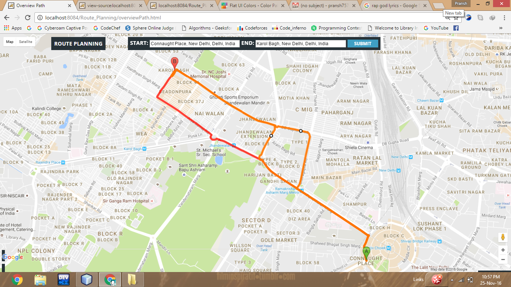 | 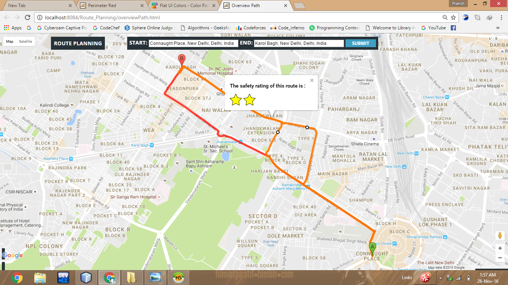|
|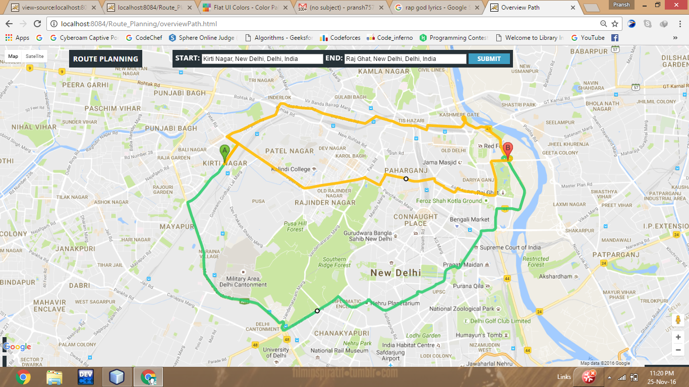 | 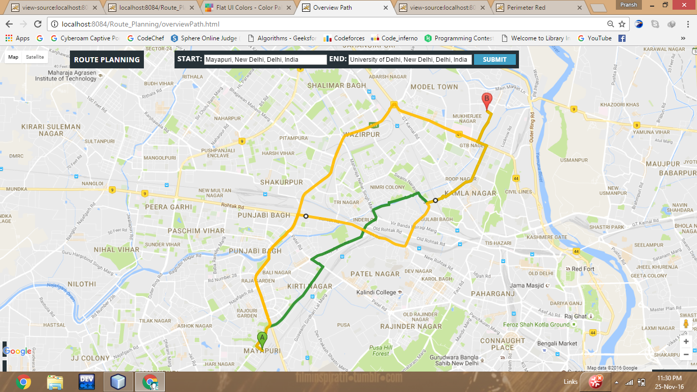|
|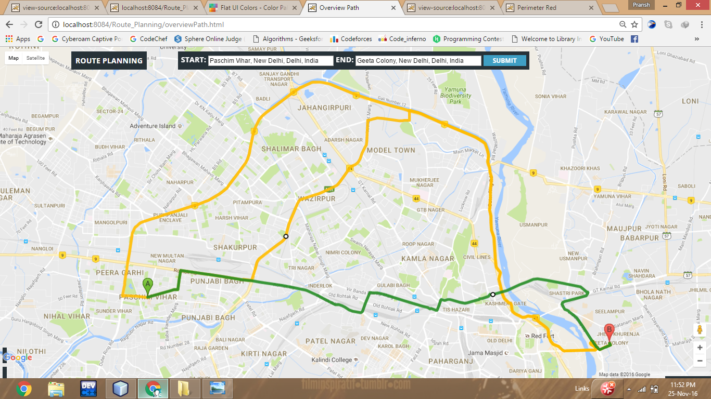 | 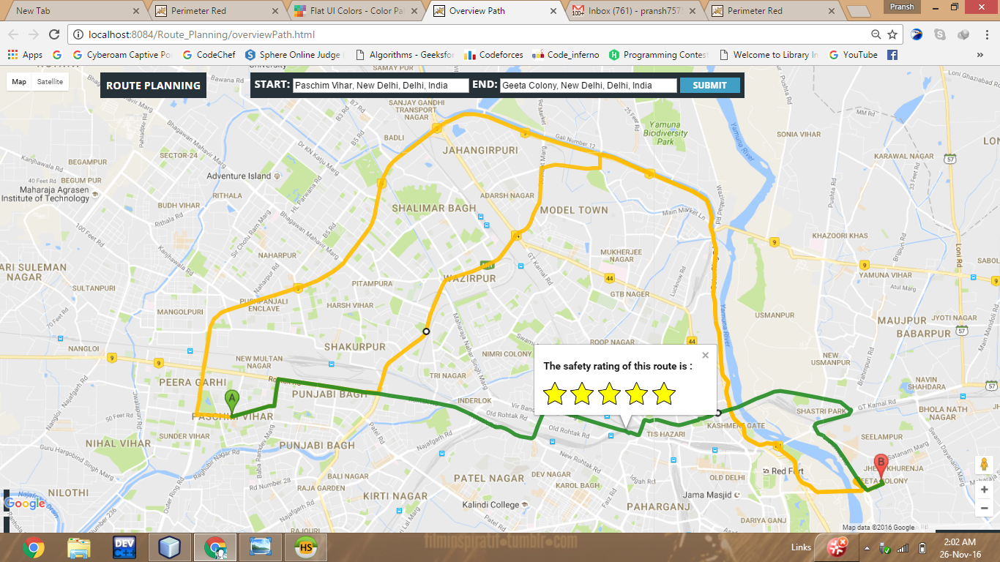|

### Route Planner: 
A web application to display information such as Hospitals, Restaurants, Police Stations et cetra along the route provided the source and destination. Google maps services like radar search, route boxing algorithm were used for this project.

### Screenshots

|  |  |
| --- | --- |
|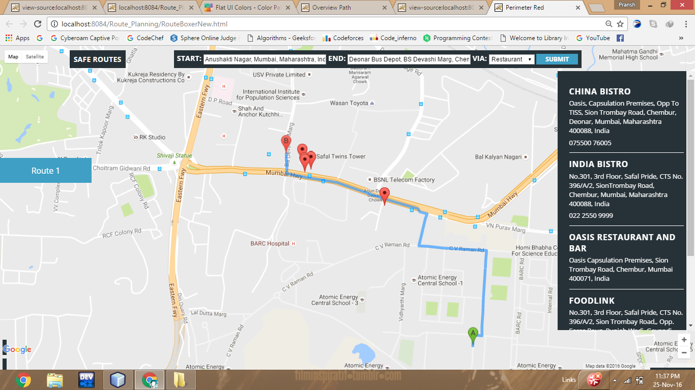 | 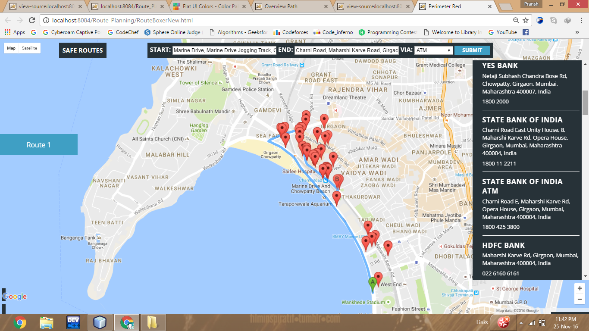|
|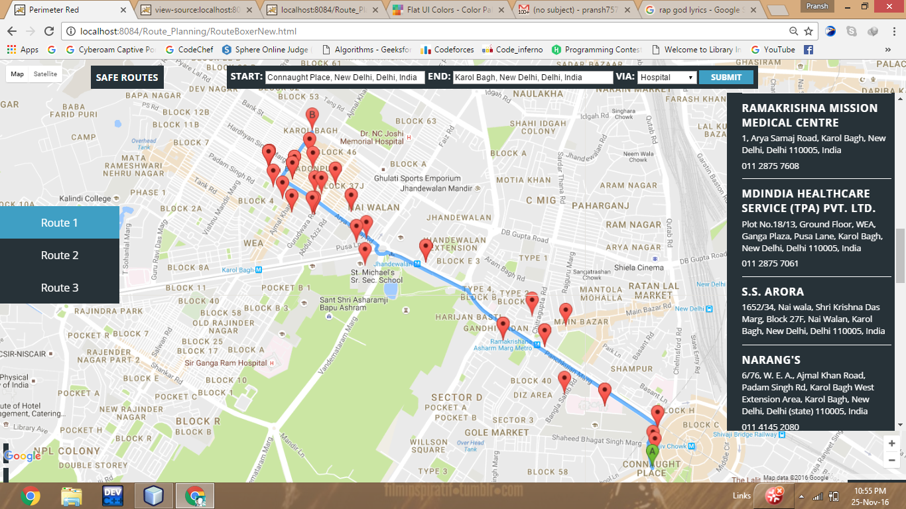 | 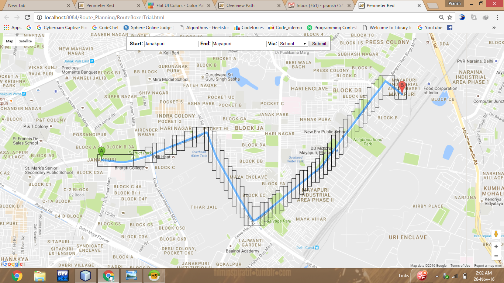|
| | 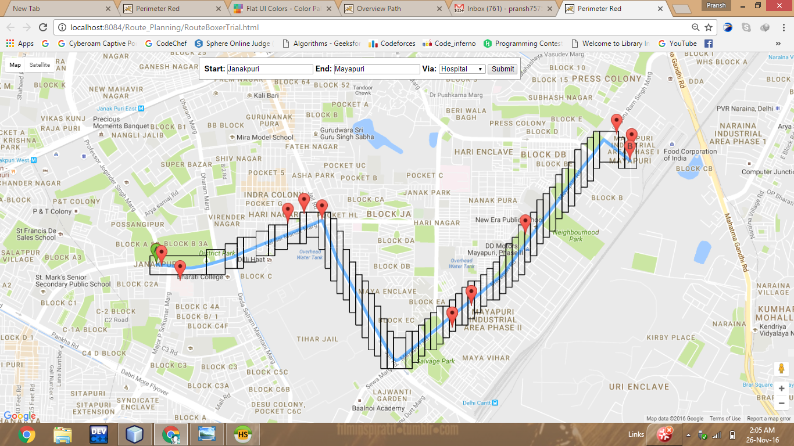|
|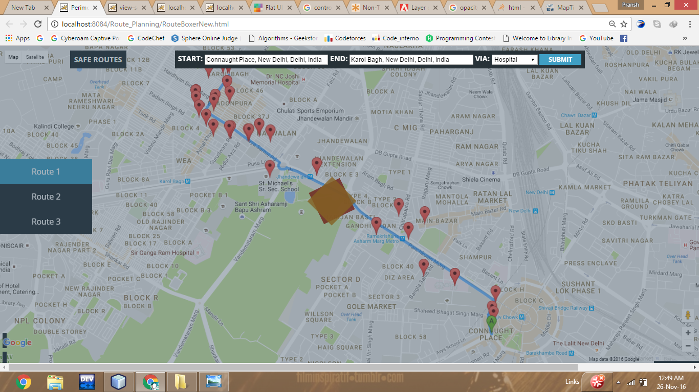 | |